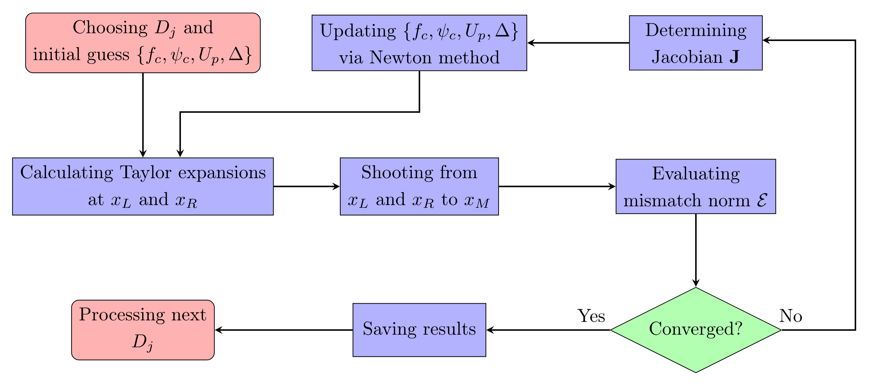
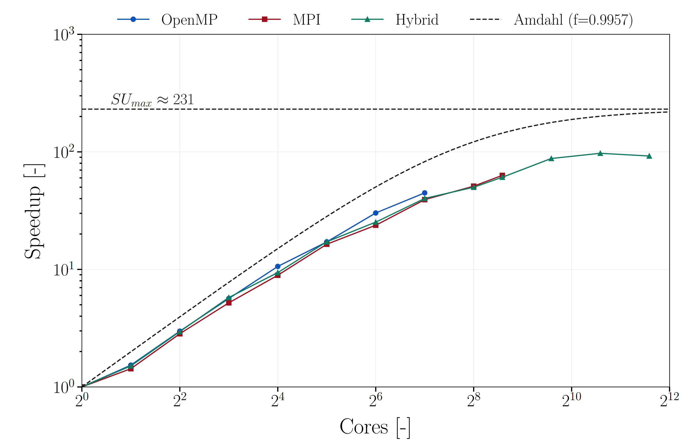
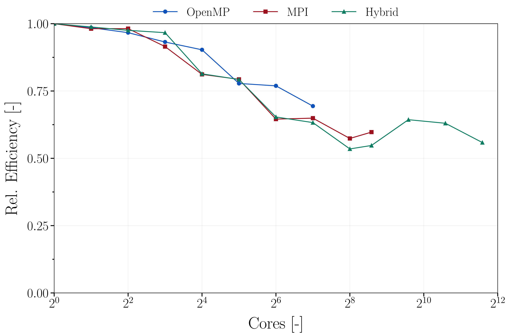
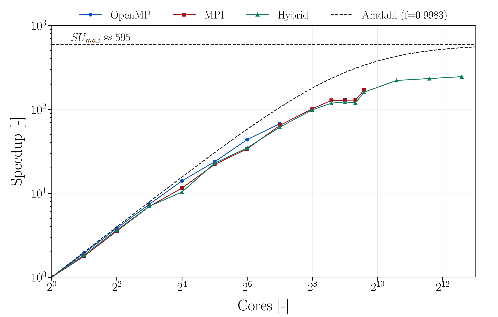
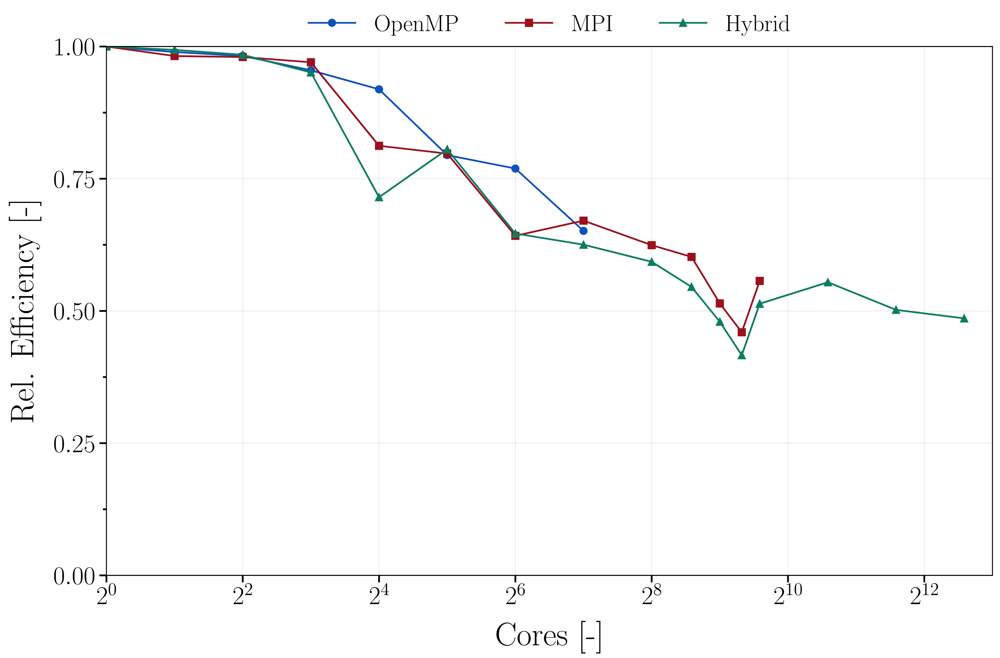

# Critical Gravitational Collapse Simulator

This project provides a modern `C++` implementation of the critical gravitational collapse of a massless scalar field in spherical symmetry. It focuses on constructing discretely self-similar solutions in rational spacetime dimensions between 3 and 5. 

The framework builds upon spectral methods in logarithmic time and finite-difference integration in space, combined with a Newton–shooting method to solve the resulting non-linear boundary value problem. It supports serial as well as parallel execution using OpenMP, MPI, or a hybrid of both, enabling efficient large-scale simulations on HPC systems.

For a detailed theoretical derivation and extensive performance analysis, please refer to the associated **Master's Thesis**:
> [**High-Performance Computing for Critical Collapse in General Relativity**](https://repositum.tuwien.at/handle/20.500.12708/220537?mode=full)

---

## Methodology

The physical model describes a massless scalar field $\psi$ coupled to Einstein gravity in $D$ spacetime dimensions under spherical symmetry. Using adapted coordinates $(\tau, x)$ where $\tau$ is logarithmic time and $x$ is a spatial coordinate compactified between the center ($x=0$) and the self-similarity horizon ($x=1$), the Einstein-Klein-Gordon system reduces to a set of coupled non-linear partial differential equations.

### System of Equations

The solver evolves the metric functions $\overline{a}(\tau,x) = a^{-2}$, $f(\tau,x)$ and the auxiliary matter fields $U(\tau,x)$, $V(\tau,x)$ (derivatives of the scalar field along null directions). The resulting first-order system is:

$$
\partial_x \overline{a} = \frac{8(D-3) - [8(D-3) + (D-2)^3 (U^2+V^2)]\overline{a}}{8x}
$$

$$
\partial_x f = \frac{(D-3)}{x}(a^2-1)f
$$

$$
\partial_x U = \frac{f[(D-2-2(D-3)a^2)U + (D-2)V] - 2x\partial_\tau U}{2x(f+x)}
$$

$$
\partial_x V = \frac{f[(D-2-2(D-3)a^2)V + (D-2)U] + 2x\partial_\tau V}{2x(f-x)}
$$

$$
\partial_\tau \overline{a} = \left[\frac{(D-2)^3}{8x}((f+x)U^2 - (f-x)V^2) + (D-3)\right]\overline{a} - (D-3)
$$

### Regularity Conditions
To obtain physically valid solutions, regularity conditions are imposed at the boundaries of the compactified domain:
* **Center ($x=0$):** Local flatness and symmetry require the metric functions to satisfy $a(\tau,0)=1$, $\partial_x a(\tau,0)=0$, and $\partial_x f(\tau,0)=0$. The matter fields must vanish linearly, i.e., $U(\tau,0)=V(\tau,0)=0$.
* **Self-Similarity Horizon ($x=1$):** To prevent divergences in the evolution equations at the horizon, a specific algebraic constraint involving the matter fields ($U, V$) and the metric must be satisfied. This ensures the solution remains smooth across the sonic point.

### Numerical Algorithm

The problem is formulated as a Boundary Value Problem (BVP). The solution strategy involves:
1.  **Pseudo-Spectral Decomposition:** The $\tau$-dependence is handled via a Fourier series to enforce periodicity.
2.  **Shooting Method:** The spatial ODEs are integrated from both boundaries ($x_L, x_R$) to a matching point $x_M$ using an implicit Runge-Kutta scheme.
3.  **Newton Iteration:** A Newton-Raphson solver adjusts the free initial data functions $\{f_c, \psi_c, U_p\}$ and the echoing period $\Delta$ to minimize the mismatch at $x_M$.

<p align="center">
  
  <br>
  <em>Schematic overview of the numerical algorithm.</em>
</p>

---

## Performance Results

The code was benchmarked on the **Vienna Scientific Cluster 5 (VSC-5)**. Below are representative scaling results for two specific workload configurations, demonstrating the efficiency of all three parallelization strategy.

### Benchmark S2: Moderate Resolution
* **Configuration:** $N_\tau = 512$, Spatial Grid Points $= 12,000$.
* **Observation:** This setup represents a standard workload. The **Hybrid approach (green)** scales effectively up to $\approx 1500$ cores. While OpenMP (blue) saturates within a single node (128 cores) and pure MPI (red) hits communication bottlenecks earlier, the hybrid model maintains higher efficiency at scale by reducing the number of MPI messages.

<p align="center">
  
  
  <br>
  <em>Speedup (Left) and Parallel relative Efficiency (Right) for Benchmark S2.</em>
</p>

### Benchmark S5: High Resolution
* **Configuration:** $N_\tau = 1024$, Spatial Grid Points $= 16,000$.
* **Observation:** Doubling the spectral resolution increases the size of the Jacobian matrix, raising the computational density relative to communication. The **Hybrid solver** achieves speedups $>250\times$ on massive core counts ($>2000$), closely following the theoretical Amdahl limit (dashed line). The efficiency plot shows that the hybrid model degrades much slower than pure MPI, making it the only viable strategy for extremely high-resolution simulations.

<p align="center">
  
  
  <br>
  <em>Speedup (Left) and Parallel relative Efficiency (Right) for Benchmark S5.</em>
</p>

---

## Building

The code supports four different build modes, configured via CMake options:

- **Serial (`cc_serial`)** – pure sequential run (always available).
- **OpenMP (`cc_openmp`)** – shared-memory parallelism on multicore CPUs.
- **MPI (`cc_mpi`)** – distributed-memory parallelism across nodes.
- **Hybrid (`cc_hybrid`)** – combined MPI + OpenMP execution.

### Dependencies

The project relies on the following libraries:

- **[CMake](https://www.cmake.org/) (≥ 3.20)** – build system
- **[FFTW3](http://www.fftw.org/)** – spectral Fourier transforms
- **[LAPACK](https://www.netlib.org/lapack/)** – linear algebra routines
- **[nlohmann/json](https://github.com/nlohmann/json)** – JSON for Modern C++
- **[OpenMP](https://www.openmp.org/)** (optional) – shared-memory parallelism
- **[MPI](https://www.mpi-forum.org/)** (optional) – distributed-memory parallelism

### Installation on Ubuntu

Update your package list and install the required development packages:

```bash
sudo apt update
sudo apt install -y build-essential cmake pkg-config \
    libfftw3-dev liblapacke-dev \
    libopenmpi-dev openmpi-bin \
    libomp-dev
```

For the JSON library, you can either install via package manager:

```bash
sudo apt install nlohmann-json3-dev
```

or fetch it with CMake’s `FetchContent` if you prefer a header-only inclusion.

Build example:

```bash
mkdir -p build && cd build
cmake -DENABLE_OPENMP=ON -DENABLE_MPI=ON -DENABLE_HYBRID=ON -DENABLE_SERIAL=ON ..
make -j
```

Executables are placed in the build directory, e.g. `cc_serial`, `cc_openmp`, `cc_mpi`, `cc_hybrid`.

---

## Command Line Parameters

Each executable accepts the following arguments:

- `-s, --single-run`  
  Run a single simulation (default).

- `-m, --multiple-run`  
  Run multiple simulations from a JSON input dictionary.

- `--ignore-converged`  
  In multiple-run mode, skip already converged simulations.

- `-i, --input-path <path>`  
  Path to a simulation input JSON file.  
  Default: `data/simulation_4D_512.json`

- `-r, --reversed-order`  
  Reverse the execution order of simulation dimensions.

- `-b, --benchmark`  
  Enable benchmark mode (repeated runs of the same simulation).

- `--benchmark-repetitions <N>`  
  Set number of repetitions in benchmark mode. Default: `3`.

---

## Examples

### Run a single simulation

```bash
./cc_serial -i data/simulation_4D_512.json
```

### Run multiple simulations from a multidimensional input file
```bash
export OMP_NUM_THREADS=8
./cc_openmp -m -i data/simulation_data.json
```

### Run multiple simulations and also recalculate already converged ones
```bash
mpirun -np 8 ./cc_mpi -m --ignore-converged -i data/simulation_data.json
```

### Run multiple simulations in reversed order (low to high dimension)
```bash
export OMP_NUM_THREADS=2
mpirun -np 4 ./cc_hybrid -m -r -i data/simulation_data.json
```

### Benchmark a single simulation with 5 repetitions
```bash 
export OMP_NUM_THREADS=2
mpirun -np 4 ./cc_hybrid -i data/simulation_4D_512.json -b --benchmark-repetitions 5
```

---

## Scripts

### `plot_simulation_results.py`

Create publication-ready figures from simulation JSON output.

**Synopsis**
```bash
python3 scripts/plot_simulation_results.py -i <FILES...> -o <OUT> -k <KIND> [--spec <SPEC>] [-e <EXP>] [-d <DIM>] [-s]
```

#### Options

- `-i, --input_files`  
  Input JSON files (one or more).  
  *Default:* predefined convergence test files.

- `-o, --output_name`  
  Output path and base name for plots, meaningful name will be added automatically.  
  *Default:* `data/cc_plot.pdf`

- `-e, --experimental_data`  
  Optional path to experimental or reference data for comparison.

- `-k, --kind`  
  Type of plot to generate.  
  Choices: `convergence`, `fields`, `initial_data`, `echoing_period`, `benchmark`, `mismatch_layer_finder`, `theoretical_speedup`, `efficiency`.  
  *Default:* `convergence`

- `--spec`  
  Plot specification/refinement.  
  Choices: `3R`, `differences`, `vminu`, `rel_su`.

- `-d, --dim`  
  Dimension to be postprocessed (if applicable).

- `-s, --single_plots`  
  Produce individual plots instead of grid plots.

#### Examples

- Generate a convergence plot (requires 5 input files):
```bash
python3 scripts/plot_simulation_results.py \
  -k convergence \
  -i data/simulation_convergence_base.json \
     data/simulation_convergence_xcut02.json \
     data/simulation_convergence_xcut04.json \
     data/simulation_convergence_xcut12.json \
     data/simulation_convergence_xcut14.json \
  -o data/cc_plot.pdf
```
- Plot initial data for a single dimension with reference comparison:
```python
python3 scripts/plot_simulation_results.py \
  -k initial_data -d 3.750 \
  -i data/simulation_data.json \
  -e data/fortran_reference.json \
  -o data/cc_plot.pdf
```

### `create_simulation_data.py`

Generate or modify simulation input JSON files (multi-D expansion, Ntau doubling, merging).

**Synopsis**
```bash
python3 scripts/create_simulation_data.py -i <IN...> -o <OUT...> -k <KIND> [-d <DIM>] [-r]
```

#### Options

- `-i, --input`  
  Input JSON file(s).  
  *Default:* `../data/simulation_config.json`

- `-o, --output`  
  Output JSON file(s).  
  *Default:* `../data/simulation_data.json`

- `-k, --kind`  
  Operation: `create_multidim`, `double_nt`, `merge`.  
  *Default:* `create_multidim`

- `-d, --dim`  
  Dimension to modify (used with `double_nt`).

- `-r, --reversed`  
  Reverse ordering or update direction.

#### Examples

- Expand template to multi-D simulation data:
```python3
python3 scripts/create_simulation_data.py \
  -k create_multidim \
  -i data/simulation_config.json \
  -o data/simulation_data.json
```
- Double Ntau for dimension 3.750:
```python3
python3 scripts/create_simulation_data.py \
  -k double_nt -d 3.750 \
  -i data/simulation_data.json \
  -o data/simulation_data_doubled.json
```

--- 

## Tests

Unit tests are included under `test/` and can be run via:

```bash
ctest
```

These validate FFT operations, LAPACK integration, and initial condition generation.

---

## License

This project is licensed under the MIT License – see the [LICENSE](LICENSE) file for details.

